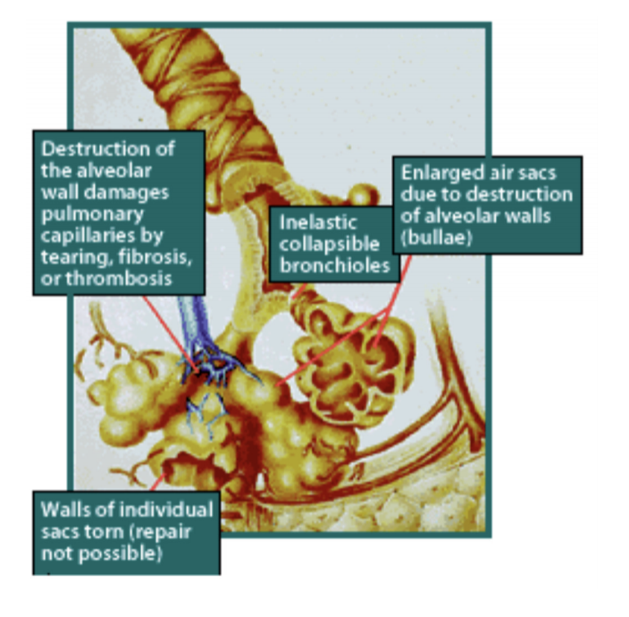
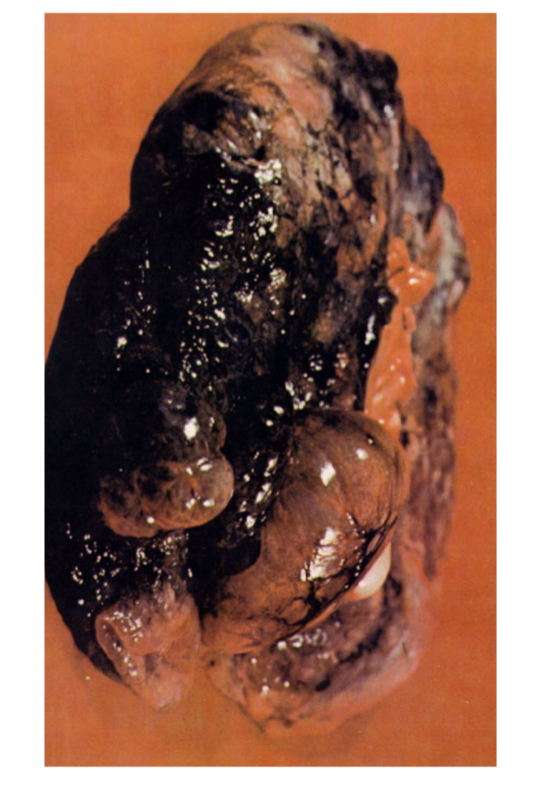
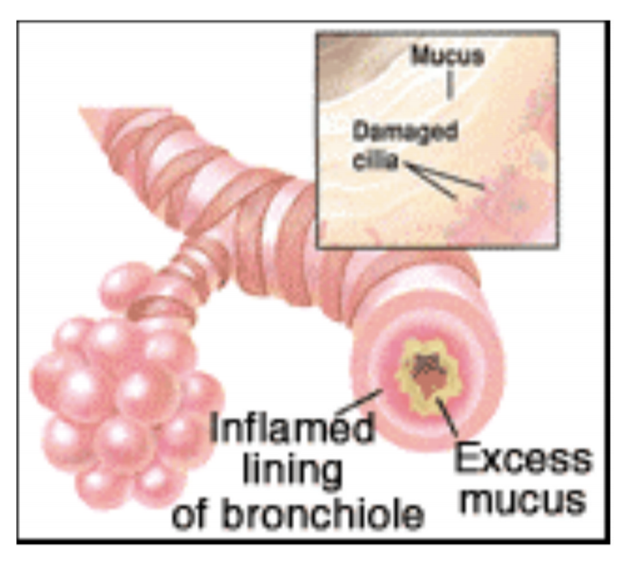

Chronic Lung Disease

* Chronic Obstructive Pulmonary Disease (COPD) is a condition of chronic dyspnea with expiratory airflow limitation that does not significantly fluctuate
* It is also known as chronic obstructive lung disease (COLD)
* There are two classifications of COPD: chronic bronchitis and emphysema. These two types of COPD can have overlapping signs and symptoms
* The primary cause of the obstruction may vary; examples include airway inflammation that narrow or blocks airflow, mucous secretion that blocks airways, and alveolar wall destruction.

# ~Question 2
Which two diseases are included in categories of COPD?

[WRONG] Asthma and atelectasis
[RIGHT] Chronic bronchitis and emphysema
[WRONG] Pneumonia and pleurisy
[WRONG] Tuberculosis and pleural effusion

* Chronic bronchitis and emphysema belong to the old classification of COPD. Asthma may be one of the chronic pulmonary diseases but atelectasis is not. Pneumonia and pleurisy are not classified under the COPD. Tuberculosis and pleural effusion are not chronic pulmonary diseases.

# ~Question 3
Which factor is involved in the underlying pathophysiology of COPD?

[WRONG] Inflamed airways that obstruct airflow
[WRONG] Mucus secretion that blocks airways
[WRONG] Alveolar wall destruction
[RIGHT] Variations in all of the options

* Inflammation, hypersecretion of mucus, and alveolar wall destruction are included in the pathophysiology of COPD. Inflammation occurs through the proximal and peripheral airways, lung parenchyma, and pulmonary vasculature. Hypersecretion occurs due to the increase in the number of goblet cells. Alveolar wall destruction leads to loss of alveolar attachments and a decrease in elastic recoil.

# ~Question 4
In a patient with COPD, where does the abnormal inflammatory response occur?

[WRONG] Airways
[WRONG] Lung parenchyma
[WRONG] Pulmonary vasculature
[RIGHT] All of the mentioned areas

* The airways, parenchyma, and pulmonary vasculature undergo inflammation in COPD.

# ~Question 5
Which condition is NOT considered a category of COPD?

[RIGHT] Pneumonia
[WRONG] Emphysema
[WRONG] Chronic bronchitis

# Emphysema

## Pathological Diagnosis

* An abnormal distention of airspaces beyond the terminal bronchioles and destruction of the walls of the alveoli.
* Patients with Emphysema, often referred to as "Pink Puffers," tend to be thin, cachetic persons with marked shortness of breath. Decreased lung compliance leads to increased work of breathing and dyspnea.

### Pathology
* Airway obstruction
* Hyperinflation
* Loss of lung elastic recoil
* Destruction of the alveolar-capillar interface

### Emphysema (Pink puffer)
* Progressive constant dyspnea
* Onset after 50 years of age
* Mild sputum – clear
* Thin, wasted, chest AP diameter increased
* BARREL chest
* Percussion – hyperresonant
* HCT normal
* CXR – bullae, blebs, hyperinflation
* Pursed lip breathing

### Emphysema
* Decreased ventilation despite increased lung capacity
* Decreased pulmonary diffusion surface
* Changes more prominent during exhalation
* Air trapping
* Tissue loses elasticity
* Alveolar septum is destroyed
* Increased number of mucus-secreting glands and cells
* Submucosal edema
* Narrowing of bronchial lumen
* Thickening of bronchial/bronchiolar walls
* Increased deadspace
* Dilation of distal airways

### Alveolus in Emphysema - 1

### Alveolus in Emphysema - 2

### Lung in Emphysema

### Destroyed Lung parenchyma

### CXR of patient with Emphysema

# ~Question 3
Which data are characteristic of a patient with emphysema?

[RIGHT] Onset after 50 years of age, AP diameter increased, lung capacity increased, pursed lip breathing
[WRONG] Onset after 50 years of age, AP diameter decreased, lung capacity decreased, pursed lip breathing
[WRONG] Onset after 50 years of age, AP diameter increased, lung capacity decreased, percussion (hyper resonant)
[WRONG] Onset after 50 years of age, AP diameter decreased, lung capacity increased, percussion (hyper resonant)

# ~Question 10
Which of the following conditions require a higher PEEP to be applied in recruiting collapsed alveoli?

[WRONG] Asthma
[RIGHT] Acute Respiratory Distress Syndrome
[WRONG] Bronchietasis
[WRONG] Emphysema

# ~Question 26
Which condition is characterized by an abnormal permanent enlargement of the air spaces distal to the bronchioles?

[RIGHT] Emphysema
[WRONG] Chronic bronchitis
[WRONG] Pneumonia

# Chronic Bronchitis

## Clinical Diagnosis
* A disease of the airways, defined as the presence of cough and sputum production for at least 3 months in each of 2 consecutive years.
* Patients with Chronic Bronchitis, often referred to as "Blue Bloaters," tend to be large persons with cyanosis, edema, and relatively little dyspnea.

### Pathology
* Thickened bronchial walls
* Hyperplasia and hypertrophied mucous glands
* Mucosal inflammation in the bronchial wall and airways

### Chronic Bronchitis (Blue Bloater)
* Intermittent mild/moderate dyspnea
* Onset after 35 years of age
* Copious sputum production
* Purulent sputum during acute infection
* Stocky, obese with normal chest AP diameter
* Percussion – normal
* HCT increased
* Hypercapnea
* Hypoxemia
* Smoker's cough
* Pulmonary HTN
* Hepatomegaly

### Chronic Bronchitis (Blue Bloater)
* Cough and sputum production for at least 3 months/year
* Overinflation of alveoli
* Abnormal distribution of ventilation
* Narrowed airways due to thickened bronchial walls
* Mucus plugs
* Bronchial and bronchiolar wall inflammation
* Decreased number and function of cilia
* Increased number and size of mucus-secreting glands

### Airway in Chronic Bronchitis

# ~Question 6
Chronic bronchitis is characterized by:

[RIGHT] Excessive secretion of bronchial mucus
[WRONG] Irritation of the sinus cavities
[WRONG] Permanent enlargement of air spaces distal to the bronchiole

# ~Question 7
Which condition is manifested by a productive cough for greater than 3 months in at least 2 consecutive years in the absence of any other disease?

[RIGHT] Chronic bronchitis
[WRONG] Acute pneumonia
[WRONG] Pneumothorax

# Infection and Pulmonary Hypertension

* Acute infection is the most common cause of death.
* Pulmonary Hypertension may result in signs and symptoms of right heart failure:
 * Dyspnea
 * Angina at rest
 * Syncope
 * Cyanosis
 * Peripheral edema
 * Hepatomegaly
 * Renal dysfunction

# ~Question 8
Which condition is a complication of pulmonary hypertension?

[RIGHT] Right heart failure
[WRONG] Pulmonary embolism
[WRONG] Pleuritis

# ~Question 9
Which findings are signs and symptoms of right heart failure?

[RIGHT] Dyspnea, syncope, peripheral edema
[WRONG] Productive cough, fever, elevated white blood count
[WRONG] Hypotension, erythema, palpitations

# Risk Factors in Chronic Bronchitis and Emphysema

* Cigarette smoking
* Chronic respiratory infections
* Occupational/environmental exposure – dust,chemicals, fumes
* Allergies
* A-protease inhibitor deficiency

COPD gradually worsens. HOWEVER, early detection, treatment and modification of risk factors can alter the disease course.

# Management

### Goals to achieve include:
* Improvement in gas exchange
* Achievement of airway clearance
* Improvement in breathing pattern
* Independence in self-care activities
* Improvement in activity intolerance
* Ventilation/oxygenation adequate to meet self-care needs
* Nutritional intake meeting caloric needs
* Infection treated/prevented
* Disease process/prognosis and therapeutic regimen understood
* Plan in place to meet needs after discharge

### Nursing priorities
* Maintain airway patency
* Assist with measures to facilitate gas exchange
* Enhance nutritional intake
* Prevent complications, slow progression of condition
* Provide information about disease process/prognosis and treatment regimen

### Nursing Care Plan interventions
* Patient and family teaching is an important nursing intervention to enhance self-management in patients with any chronic pulmonary disorder

To achieve airway clearance:
* The nurse must appropriately administer bronchodilators and corticosteroids and become alert for potential side effects.
Direct or controlled coughing
* The nurse instructs the patient in direct or controlled coughing, which produces a more effective cough effort and reduces fatigue

To improve breathing pattern:
* Inspiratory muscle training: This may help improve the breathing pattern
* Diaphragmatic breathing: Diaphragmatic breathing reduces respiratory rate, increases alveolar ventilation, and sometimes helps expel as much air as possible during expiration
* Pursed lip breathing: Pursed lip breathing helps slow expiration, prevents collapse of small airways, and controls the rate and depth of respiration

To improve activity intolerance:
* Manage daily activities: Daily activities must be paced throughout the day and support devices can be also used to decrease energy expenditure
* Exercise training: Exercise training can help strengthen muscles of the upper and lower extremities and improve exercise tolerance and endurance
* Walking aids: Use of walking aids may be recommended to improve activity levels and safety with ambulation

To monitor and manage potential complications:
* Monitor cognitive changes: The nurse should monitor for cognitive changes such as personality and behavior changes and memory impairment
* Monitor pulse oximetry values: Pulse oximetry values are used to assess the patient’s need for oxygen and administer supplemental oxygen as prescribed
* Prevent infection: The nurse should encourage the patient to be immunized against influenza and S. pneumonia because the patient is prone to respiratory infection

Evaluating the effectiveness of the interventions outlined in the plan of care can be achieved by verifying that the patient:
* Identifies hazards of cigarette smoking
* Identifies resources for smoking cessation
* Enrolls in smoking cessation program
* Minimizes or eliminates exposures
* Verbalizes the need for adequate fluids
* Remains free of infection
* Practices breathing techniques
* Performs activities with less shortness of breath

# ~Question 6
Goals to achieve in management of patients with COPD include all of the following, EXCEPT:

[WRONG] Achievement of airway clearance
[WRONG] Improvement in breathing pattern
[WRONG] Independence in self-care activities
[RIGHT] Continuation of existing lifestyle

* The patient should be made aware of existing habits which are causing COPD (e.g. smoking, exposure to chemicals) and encouraged to make changes.

# Guidelines and Treatment

## Guidelines
### Discharge and Home Care Guidelines

It is important for the nurse to assess the knowledge of patient and family members about self-care and the therapeutic regimen.

* Setting goals: If the COPD is mild, the objectives of the treatment are to increase exercise tolerance and prevent further loss of pulmonary function. If the COPD is severe, the objectives are to preserve current pulmonary function and relieve symptoms as much as possible.

* Temperature control: The nurse should instruct the patient to avoid extremes of heat, cold, and altitude. Heat and cold increase the oxygen requirements and high altitudes increase hypoxemia.

* Activity moderation: The patient should adapt a lifestyle of moderate activity and avoid emotional disturbances or stressful situations that might trigger a coughing episode.

* Breathing retraining: The nurse must provide the education and breathing retraining necessary to optimize the patient’s functional status

### Documentation Guidelines

Documentation is an essential part of the patient’s chart to reflect the plans, interventions and medications, and the patient's responses to the treatment.

* Document assessment findings including level of alertness, respiratory rate, character of breath sounds; frequency, amount and appearance of secretions, and laboratory findings
* Document conditions that interfere with oxygen supply
* Document plan of care and specific interventions
* Document liters of supplemental oxygen
* Document client’s responses to treatment, teaching, and actions performed
* Document teaching plan
* Document modifications to plan of care
* Document attainment or progress towards goals

## Treatments

The following are treatments to manage COPD:
* Smoking cessation
* Reducing exposure to airway irritants
* Supplementing oxygen
* Preventing infection
* Treating infection/purulent sputum with antimicrobials
* Administering medications similar to those used for asthma

## Anticholinergic agents

* Decrease airway secretions and smooth muscle tone
* Tipratropium bromide (Atrovent) and tiotropium bromide (Spiriva)
* Side effects – dry mouth and hacking cough

## Drug for Respiratory Muscles and Bronchodilator Activity
### Theophylline
* Theodur
* Undur
* Uniphyl-theophylline time released

## Drug for Thinning Sputum
* Guaifenesin (Hytuss, Robitussin)
* Acetylcysteine (Mucomyst)

# Bronchodilators

### Short acting inhaled agents - 2 puffs QID and PRN
* Albuterol (Proventil, Ventolin)
* Metaproterenol (Alupent)
* Pirbuterol (Maxir)
* Terbutaline (Brethine) 2 puffs TID

### Short acting ORAL agents.
* Albuterol (Volmax) – 2 – 4 mg TID
* Albuterol extended release (Repetab) 4 mg q 12h

### Long acting inhaled agents
* Salmeterol (Serevent). Prolonged receptor-binding, requires patient education to avoid cardiac arrhythmias

# ~Question 8
Which classification of drugs includes albuterol, terbutaline, and metaproterenol?

[RIGHT] Bronchodilators
[WRONG] Expectorants
[WRONG] Antibiotics

# ~Question 9
Which effect does the bronchodilator Salmeterol (Serevent) have?

[RIGHT] A long acting inhaled agent
[WRONG] A short acting inhaled agent

# Corticosteroids

### Metered dose inhalers
* Triamcinilone acetonide (Azmacort)
* Fluticasone propionate (Flovent)
* Beclomethasone dipropionate (Beclovent, Vanceril)

### Oral tablets
* Prednisone

### Intravenous administration
* Methylprednisone (Medrol)
* Methylprednisone sodium succinate (Solumedrol) for severe exacerbations

### Intramuscular administration
* Methylprednisolone (Depo-medrol)
* Triamicinole acetozide (Kenalog)

# ~Question 10
Which drug classification includes triamcinolone (Azmacort), fluticasone (Flovent), and beclomethasone (Vanceril)?

[RIGHT] Corticosteroids
[WRONG] Bronchodilators
[WRONG] Antitussives

# ~Question 11
How are triamcinolone (Azmacort), fluticasone (Flovent), and beclomethasone (Vanceril) delivered?

[RIGHT] Metered dose inhaler
[WRONG] Oral tablets

# ~Question 12
Which drug is an oral corticosteroid commonly prescribed for the treatment of respiratory illnesses?

[RIGHT] Prednisone
[WRONG] Triamcinolone
[WRONG] Fluticasone
