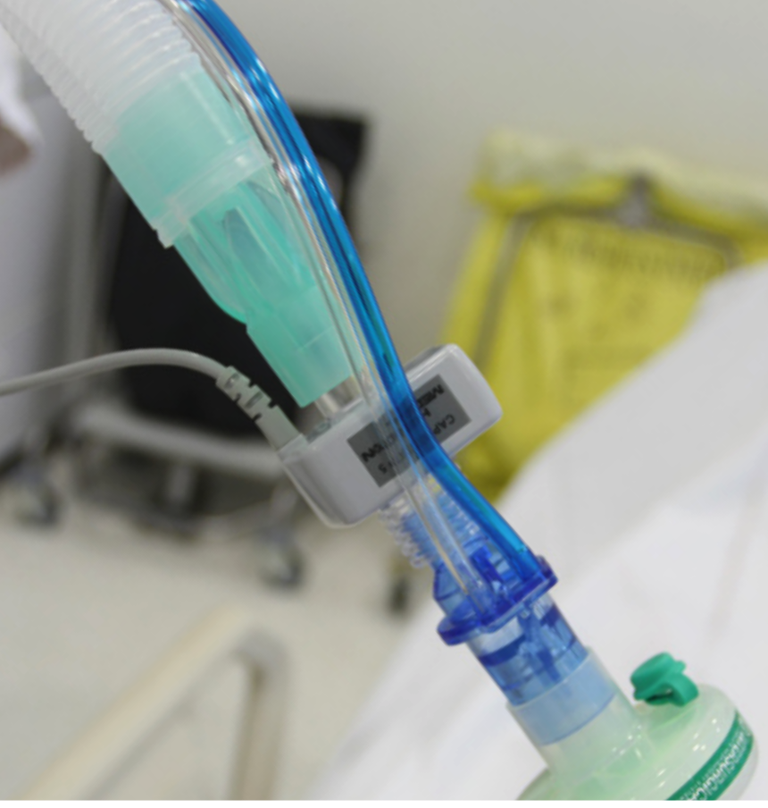

# Background

Carbon dioxide (CO2) is the most abundant gas produced by the human body. CO2 is the primary drive to breathe and a primary motivation for mechanically ventilating a patient. Monitoring the CO2 level during respiration (capnography) is noninvasive, easy to do, relatively inexpensive, and has been studied extensively.

Capnography has improved over the last few decades thanks to the developement of faster infrared sensors that can measure CO2 at the airway opening in realtime. By knowing how CO2 behaves on its way from the bloodstream through the alveoli to the ambient air, physicians can obtain useful information about ventilation and perfusion.

There are two distinct types of capnography: Conventional, **time-based capnography** allows only qualitative and semi-quantitative, and sometimes misleading, measurements, so **volumetric capnography** has emerged as the preferred method to assess the quality and quantity of ventilation.

# Benefits of volumetric capnography

* Improves, simplifies, and complements patient monitoring in relation to metabolism, circulation, and ventilation (V/Q)
* Provides information about the homogeneity or heterogeneity of the lungs
* Trend functions and reference loops allow for more comprehensive analysis of the patient condition
* Multiple clinical applications, such as detection of early signs of pulmonary emboli, COPD, ARDS, etc.
* Helps you optimize your ventilator settings
* Is easy to do and is relatively inexpensive

In short, volumetric capnography is a valuable tool to improve the ventilation quality and efficiency for your ventilated patients.

Here's an additional video explaining the basics of capnography:
[embed](https://www.youtube.com/watch?v=_KKliTT3DSo)

# Question 1
Capnography is used for all of the following reasons EXCEPT:

[WRONG] It is noninvasive
[WRONG] It reflects a return to normal circulation before any other measurement 
[WRONG] It is a simple small portable device
[WRONG] It is a reliable tool in determining whether an endotracheal tube has been properly placed 
[RIGHT] It is the most accurate tool for diagnosing respiratory acidosis
