# What is the clinical relevance?

### Improve ventilation quality and efficiency
You can use the insights from the CO2 curve to improve ventilation quality and efficiency for your patients. On the following pages, you will find examples for the use of the CO2 curve in the clinical scenarios listed below:
* Signs of ARDS
* PEEP management
* Recruitment maneuver
* Expiratory resistance
* Obstructive lung disease
* Pulmonary embolism
* Hemorrhagic shock
* Optimize management of the weaning process
* Monitor perfusion during patient transport
* Detection of rebreathing

# Signs of ARDS - Acute respiratory distress syndrome
In ARDS, the ventilation/perfusion ratio is disturbed and changes in the slope of the volumetric capnogram curve can be observed.

* Phase I is larger due to increased anatomical dead space caused by PEEP.
* The slope of Phase II is decreased due to lung perfusion abnormalities.
* The slope of Phase III is increased due to lung heterogeneity.

# PEEP management
If PEEP is too high, the intrathoracic pressure rises, the venous return decreases, and pulmonal vascular resistance (PVR) increases. These changes can be easily observed on the volumetric capnogram.

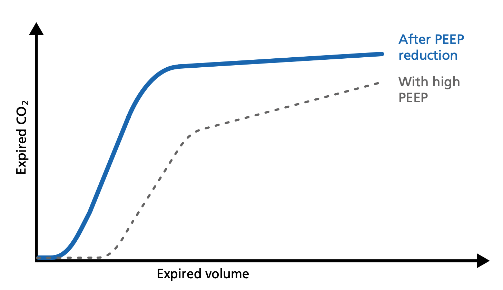

* An increase in Phase I shows an increase in anatomical dead space.
* A decrease in the Phase II slope indicates a decrease in perfusion.
* An increase in the Phase III slope depicts a maldistribution of gas, which can be caused by an inappropriately low PEEP setting or an inappropriately high PEEP setting causing lung overdistension.

# Recruitment maneuver
The volumetric capnogram can be used to assess the effectiveness of recruitment maneuvers and might give you an insight into the recruited lung volume.

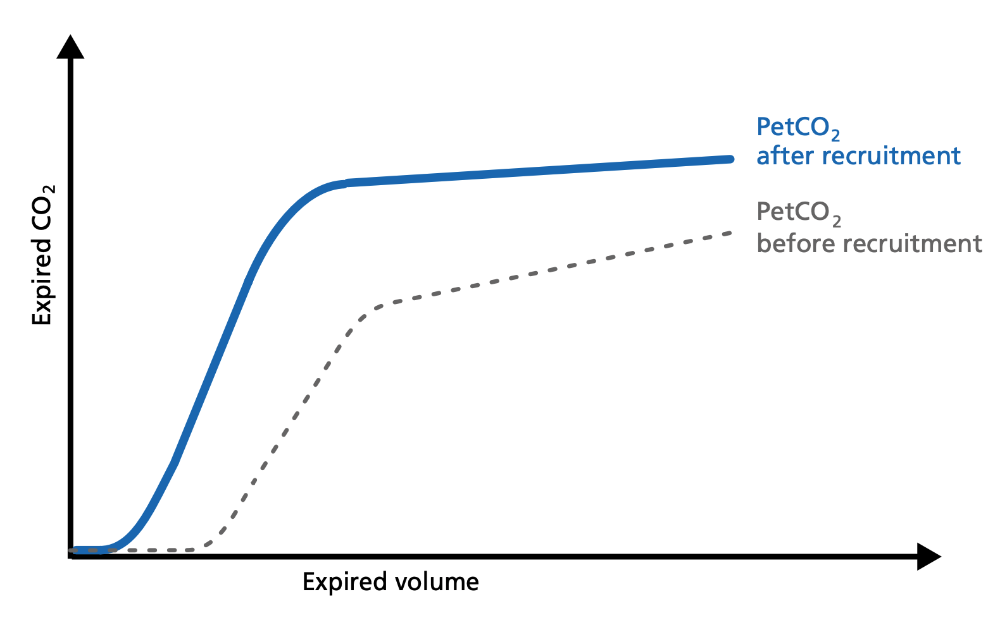

* After a sucessful recruitment maneuver,you should see a transient increase in V‘CO2.
* Phase I may decrease a little. The slope of Phase II becomes steeper with improved lung perfusion. The slope of Phase III improves as a result of more homogeneous lung emptying.

# Expiratory resistance
Concave Phase-III volumetric capnograms have been seen with obese patients and patients with increased expiratory resistance. Obese patients (Fig. 1) can have biphasic emptying and higher PetCO2 than PaCO2. That difference suggests varying mechanical and ventilation/perfusion properties. The increase in expiratory resistance (Fig. 2) may reflect a slow expiratory phase with a slow accumulation of alveolar CO2. The alveoli that empty last may have more time for CO2 diffusion.

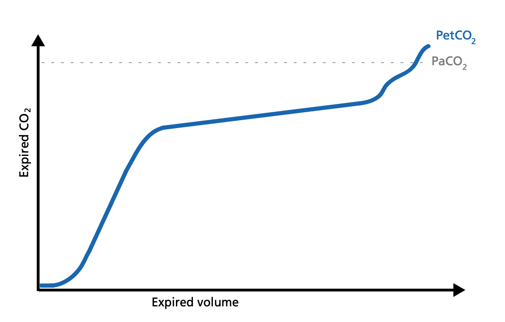
Fig 1: Concave volumetric capnogram associated with obesity

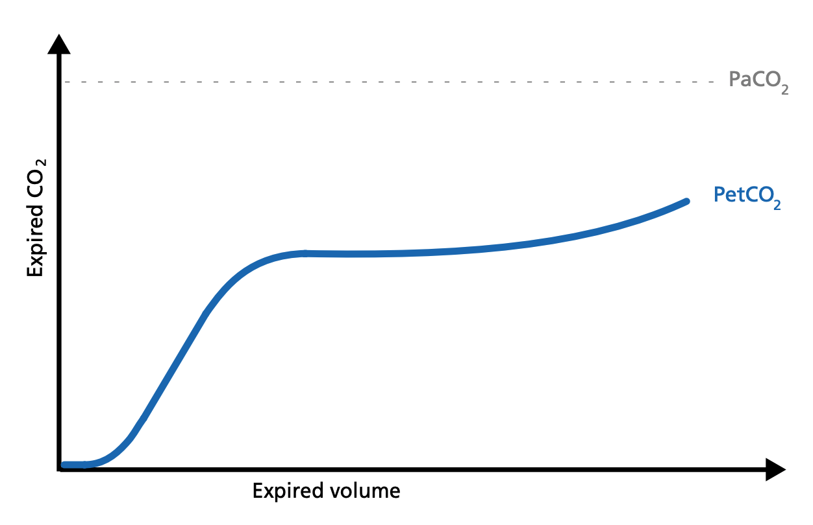
Fig 2: Concave volumetric capnogram associated with increased airway resistance

# Obstructive lung disease
When spirometry cannot be reliably performed, volumetric capnography can be used as an alternative test to evaluate the degree of functional involvement in obstructive lung disease patients (COPD, asthma,cystic fibrosis, etc.). Obstructive lung disease is characterized by asynchronous emptying of compartments with different ventilation/perfusion ratios.

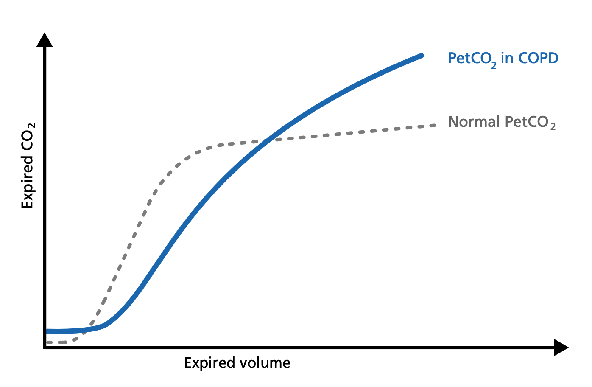

* The volumetric capnogram in COPD patients shows a prolonged Phase II, an increase in PetCO2, and a continuously ascending slope without plateau in Phase III.

Patients with high airway resistance demonstrate an decrease in the Phase II slope and a steep slope in Phase III. The volumetric capnogram can give you insights into therapy efficiency.

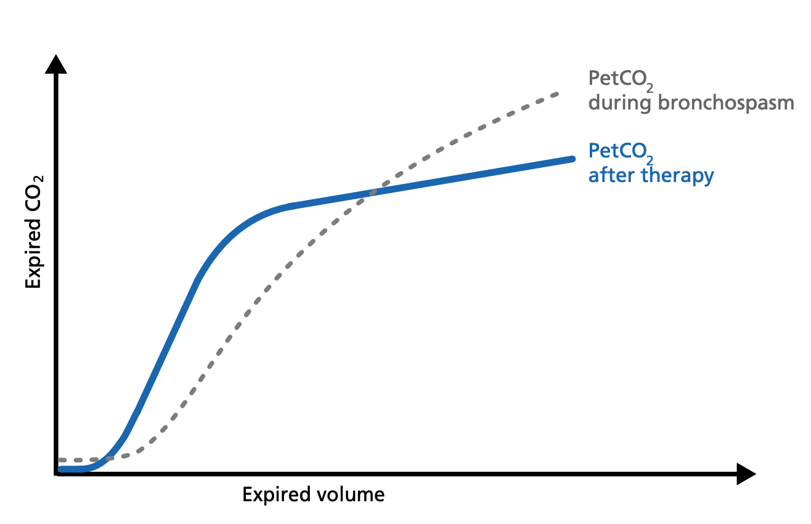

* A Phase II shift to the left indicates reduced resistance.

* Phase III slope shows a decrease in steepness indicating better gas distribution and reduced alveolar dead space (VDalv). 

# Signs for pulmonary embolism
Pulmonary embolism (PE) leads to an abnormal alveolar dead space that is expired in synchrony with gas from normally perfused alveoli. This feature of PE separates it from pulmonary diseases affecting the airway, which are characterized by nonsynchronous emptying of compartments with an uneven ventilation/perfusion relationship. In case of sudden pulmonary embolism, volumetric capnography has a typical unique shape.

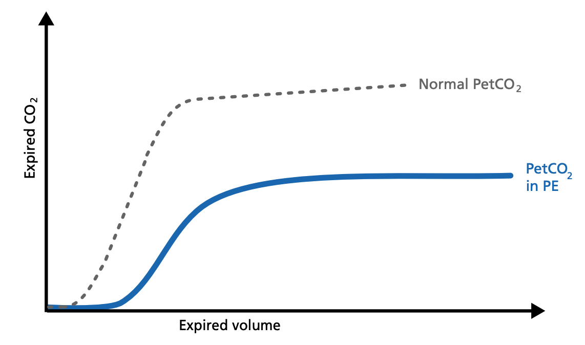

* In patients with sudden pulmonary vascular occlusion due to pulmonary embolism, Phase I is increased due to increased anatomical dead space.

* The slope of Phase II is decreased due to poor lung perfusion. Phase III has a normal plateau with low PetCO 2 because the number of functional alveoli is reduced. In this case, V‘CO2 drops suddenly.

# Hemorrhagic shock
Hemorrhagic shock is a condition of reduced tissue perfusion, resulting in the inadequate delivery of oxygen and nutrients that are necessary for cellular function.

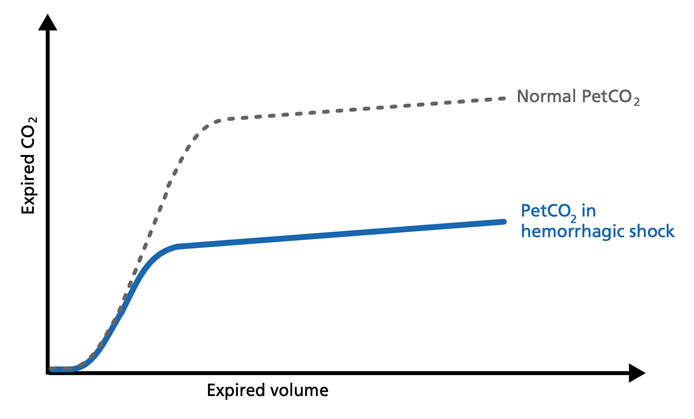

* The expired CO 2 drops drastically. Phase I is unchanged and the slopes of Phase II and III are unchanged, but PetCO2 is decreased due to the increase in alveolar dead space.

# Optimize management of the weaning process
The volumetric capnogram and trends show the patient‘s response to the weaning trial and allow for better management of the weaning process.

### Indications for a successful weaning trial are

* **Stable V‘alv and constant tidal volumes**
    As ventilatory support is being weaned, the patient assumes the additional work of breathing while V‘alv remains stable and spontaneous tidal volumes remain constant.

* **V‘CO2 remains stable and then slightly increases**
    The slight increase in V‘CO2 represents an increase in CO2 production as patient work of breathing increases in association with the decrease in ventilatory support. This suggests an increase in metabolic activity due to the additional task of breathing by the patient.

### Indications for an unsuccessful weaning trial are:

* **Dramatic increase in V‘CO2**
    A more dramatic increase in V‘CO2 would suggest excessive work of breathing and the potential for impending respiratory decompensation. This scenario would be consistent with a visual assessment of increasing respiratory distress (for example, retraction, tachypnea, and agitation). The V‘CO2 will eventually decrease if the patient gets exhausted.
* **Decrease in V‘CO2**
    As the ventilator settings are decreased, the patient is no longer able to maintain an adequate degree
    of spontaneous ventilation, and total minute ventilation falls with a decrease in CO2 elimination.
* **Increased VDaw/Vte ratio**
    If reducing ventilatory support is followed by a decrease in tidal volume, the VDaw/Vte ratio increases. This reduces ventilatory efficiency and the patient’s ability to remove CO2.

# Monitor perfusion during patient transport
If arterial access is not something you routinely perform when you transport a ventilated patient, PetCO2 can be used for monitoring perfusion and ventilation during transport.

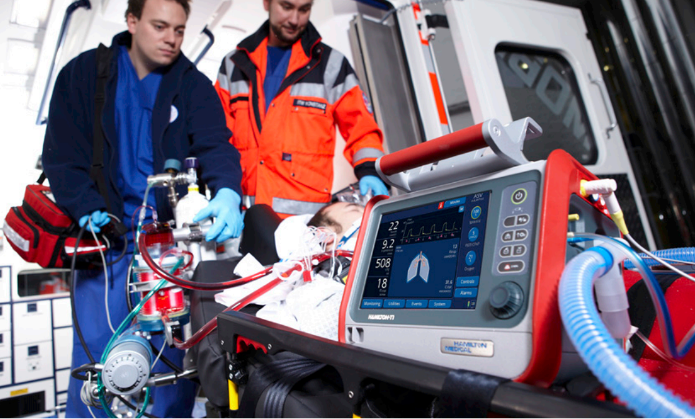

### A decrease in PetCO2 accompanied by a decrease of VCO 2 can signify:
* ET tube displacement
* Decreased cardiac output
* Pulmonary embolism
* Atelectasis
* Overdistension of alveoli (for example,excessive PEEP)

# Detection of rebreathing
An elevation of the baseline during Phase I indicates rebreathing of CO2, which may be due to mechanical problems or therapeutic use of mechanical dead space.

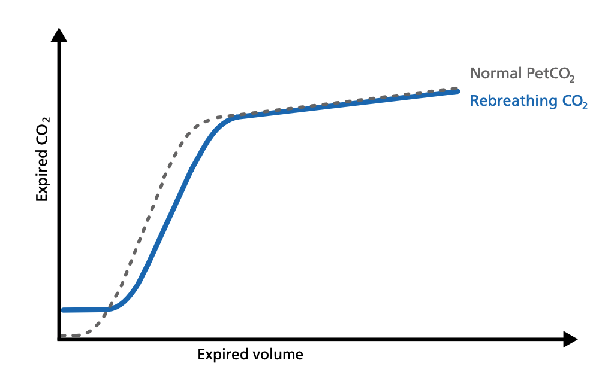

Consider recalibration of the CO2 sensor or reduction of the airway accessories.

# Question 1
Adult female patient, hospitalized comatose after car accident with no visible injuries, presents after intubation with low blood pressure, hyperglycemia, and a heart rate of 118 beats/min (tachycardia).

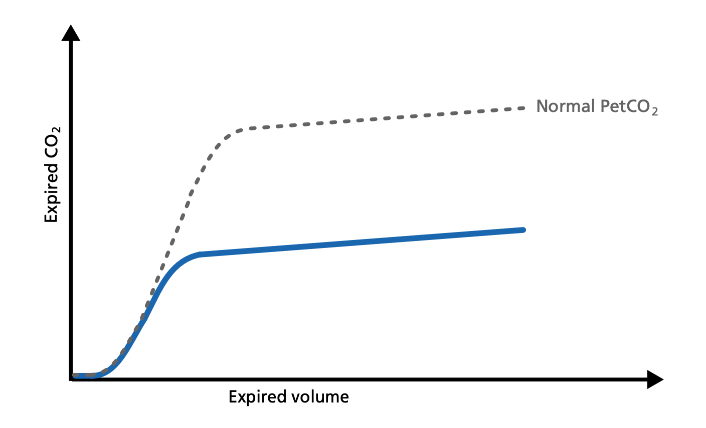

What does the volumetric capnogram indicate?

[WRONG] Pneumothorax
[WRONG] ARDS
[RIGHT] Hemorrhagic shock

# Question 2
Adult female intubated patient presents with a respiratory rate of 35 breaths/min (tachypnea) and swollen calves. 

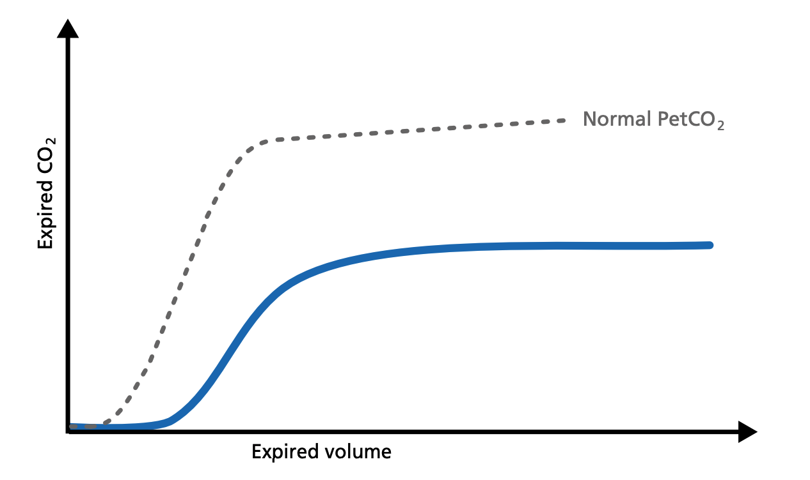

What does the volumetric capnogram indicate?

[RIGHT] Pulmonary embolism
[WRONG] ARDS
[WRONG] Sepsis

# Question 3
Adult male intubated patient presents with a dry, nonproductive cough, crackling noises in the lungs, and a heart rate of 110 beats/min (tachycardia). 

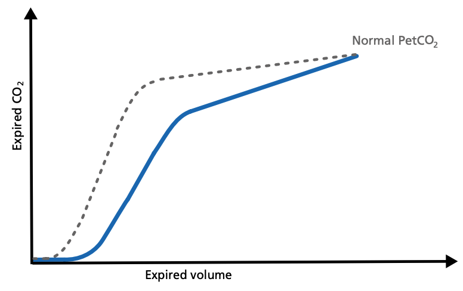

What does the volumetric capnogram indicate?

[WRONG] Cardiac arrest
[RIGHT] ARDS
[WRONG] Sepsis

# Question 4
Adult male intubated patient presents with blueness of the lips and fingernail beds (cyanosis), oxygen saturation (SaO2) of 89%, and the x-ray shows overexpanded lungs. 

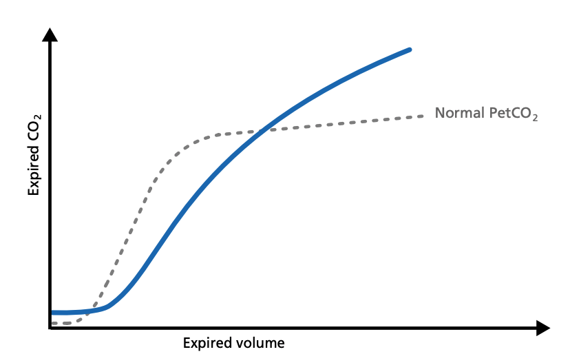

What does the volumetric capnogram indicate?

[WRONG] PEEP is too high
[WRONG] Pulmonary embolism
[RIGHT] Severe COPD