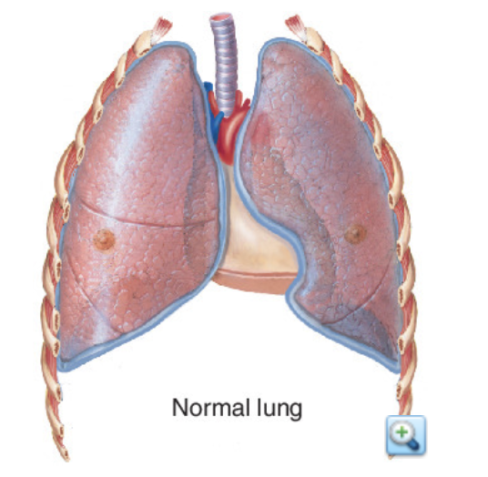
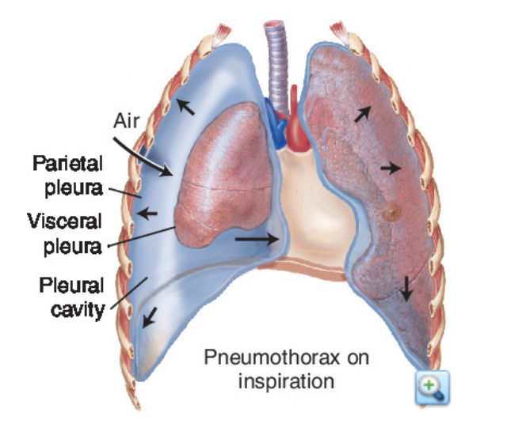
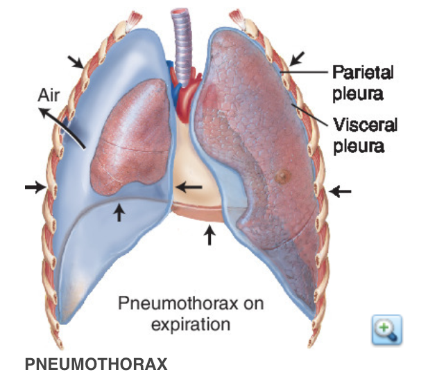
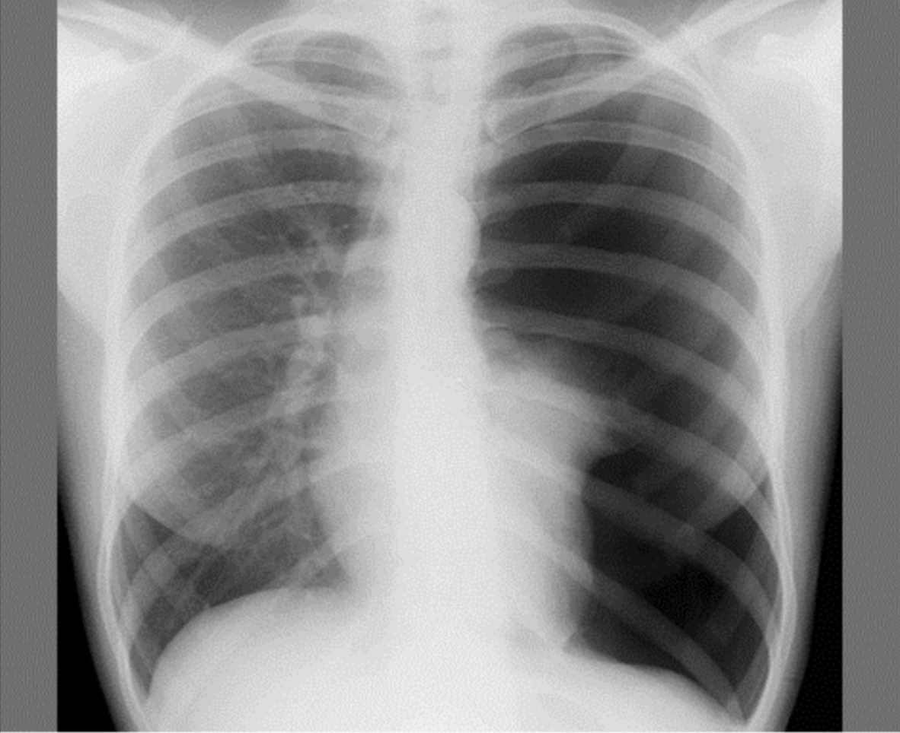
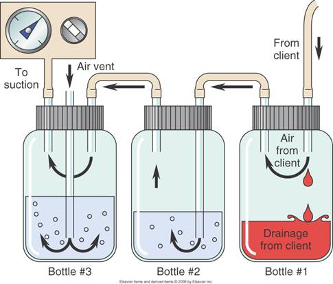
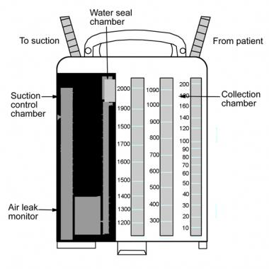

# Pneumothorax

A pneumothorax is defined as a collection of air outside the lung but within the pleural cavity. It occurs when air accumulates between the parietal and visceral pleurae inside the chest. This is different from a hemothorax which results from blood collecting in the pleural cavity. The air accumulation can apply pressure on the lung and make it collapse, impairing oxygenation and/or ventilation. The degree of collapse determines the clinical presentation of pneumothorax.

Air can enter the pleural space by two mechanisms, either through the chest wall (parietal pleura) or from the lung (visceral pleura). There are two types of pneumothorax:
* Traumatic
* Atraumatic

The two subtypes of atraumatic pneumothorax are primary and secondary. A primary spontaneous pneumothorax (PSP) occurs automatically without a known eliciting event, while a secondary spontaneous pneumothorax (SSP) occurs subsequent to an underlying pulmonary event. A traumatic pneumothorax can be the result of blunt or penetrating injury. Pneumothoraces can be even further classified as *simple*, *tension*, or *open*.

A simple pneumothorax is an isloated pocket of air within the pleura that does not shift the mediastinal structures.

A tension  pneumothorax occurs when a trapped pocket of air expands without ability to escape through the shest wall, causing increased pressure and shifting of the mediastinal structures including the heart. Open pneumothorax is an open wound in the chest wall through which air moves in and out of the pleura.  

A tension pneumothorax is a critical event that progresses rapdily, reducing venous return to the heart, and requires immediate intervention. The most common cause of a tension pneumothorax is mechanical ventilation.

# ~Question 10
The presence of air or gas in the pleural cavity is known as what?

[WRONG] Hemothorax
[WRONG] Pulmonary edema
[RIGHT] Pneumothorax
[WRONG] Pneumoconiosis

# ~Question 16
Which of the following is also known as a “sucking” chest wound?

[RIGHT] Open pneumothorax
[WRONG] Simple pneumothorax
[WRONG] Tension pneumothorax

# ~Question 11
How does air accumulation in the pleural cavity affect the lungs?

[RIGHT] The lungs collapse and vital capacity increases
[WRONG] The lungs expand and vital capacity decreases
[WRONG] The lungs collapse and vital capacity decreases

# ~Question 12
What causes the lungs to collapse in a pneumothorax?

[RIGHT] Pressure on the lung due to air accumulation
[WRONG] Pressure on the lung due to blood accumulation
[WRONG] An excessive buildup of fluid in the pleural cavity

# ~Question 13
Which type of pneumothorax occurs automatically without a known eliciting event?

[RIGHT] Primary spontaneous pneumothorax
[WRONG] Secondary spontaneous pneumothorax
[WRONG] Traumatic pneumothorax

# ~Question 14
Which type of pneumothorax occurs subsequent to an underlying pulmonary disease?

[RIGHT] Secondary spontaneous pneumothorax
[WRONG] Primary spontaneous pneumothorax
[WRONG] Traumatic pneumothorax

# ~Question 17
A collection of blood in the pleural space is known as what?

[RIGHT] Hemothorax
[WRONG] Pneumothorax
[WRONG] Pleural effusion

# Etiology & Epidemiology

## Etiology

#### Most common causes of a primary spontaneous pneumothorax

* Smoking
* Tall, underweight young adults (most commonly males) who are otherwise healthy
* Pregnancy
* Marfan syndrome
* Familial or previous pneumothorax

#### Most common causes of a secondary spontaneous pneumothorax:

Disease Processes
* COPD
* Asthma
* Tuberculosis
* Pulmonary fibrosis
* Severe Acute Respiratory Distress Syndrome (ARDS)
* Inhalational drug use like cocaine or marijuana

Medical interventions
* Pleural biopsy or aspiration
* Central venous catheter insertion
* Tracheostomy
* Positive pressure ventilation

Trauma
* Penetrating or blunt trauma to the chest
* Rib fracture

Causes that lead to tension pneumothorax
* Barotrauma due to positive pressure ventilation
* Percutaneous tracheostomy
* An untreated or advancing simple pneumothorax
* Open pneumothorax when an occlusive dressing allows air into, but not out of, the pleural space

## Epidemiology
Primary spontaneous pneumothorax mostly occurs in 20-30 years of age. The incidence of PSP in the United States is 7 per 100,000 men and 1 per 100,000 women per year. The majority of recurrence occurs within the first year, and incidence ranges widely from 25% to 50%. The recurrence rate is highest over the first 30 days.

Secondary spontaneous pneumothorax is more seen in old age patients 60-65 years. The incidence of SSP is 6.3 and 2 cases for men and women per 100,000 patients, respectively. The male to female ratio is 3:1. COPD has an incidence of 26 pneumothoraces per 100,000 patients. The risk of spontaneous pneumothorax in heavy smokers is 102 times higher than non-smokers.

The leading cause of medically induced (iatrogenic) pneumothorax is transthoracic needle aspiration (usually for biopsies), and the second leading cause is central venous catheterization. These occur more frequently than spontaneous pneumothorax, and their number is increasing as intensive care modalities are advancing. The incidence of iatrogenic pneumothorax is 5 per 10,000 admissions in the hospital.

The incidence of tension pneumothorax is difficult to determine as one-third of cases in trauma centers have decompressive needle thoracostomies before reaching the hospital, and not all of these had tension pneumothorax.

Pneumomediastinum (air in the medistinum) has an incidence of 1 case per 10,000 admissions in the hospital.

# ~Question 1
All of the following are causes of pneumothorax except:

[WRONG] Air entering pleural space from atmosphere due to a trauma
[WRONG] Air entering the pleural space from a rupture in lung parenchyma
[RIGHT] Air being produced by a bacterial infection in pleural space
[WRONG] Air entering pleural space from a hole in the trachea

# ~Question 2
All of the following can cause a pneumothorax except:

[WRONG] A person stabbed in the back just below the apex of the scapula by a 7 inch knife
[WRONG] A person on a ventilator
[RIGHT] A patient receiving chemotherapy
[WRONG] Placement of a central line
[WRONG] Complication from a tracheostomy

# ~Question 3
Which of the following is a cause of primary pneumothorax?

[WRONG] Trauma
[WRONG] COPD
[WRONG] Mechanical ventilation
[WRONG] Pneumonia
[RIGHT] None of the options

# ~Question 4
All of the following are examples of Secondary pneumothorax except:

[WRONG] A patient in the ICU on a ventilator
[RIGHT] A spontaneous pneumothorax in a young patient with a history of smoking but no known disease
[WRONG] A patient with lung cancer
[WRONG] A patient with Marfan syndrome
[WRONG] A patient with tuberculosis

# ~Question 31
A patient suffered a stab wound that damaged the pleura allowing air into the pleural space. What is the correct term for this?

[WRONG] Tension pneumothorax
[RIGHT] Open pneumothorax
[WRONG] Iatrogenic pneumothorax
[WRONG] Primary pneumothorax

# Pathophysiology
The pressure gradient inside the thorax changes with a pneumothorax. Normally the pressure of the pleural space is negative when compared to atmospheric pressure. When the chest wall expands outwards, the lung also expands outwards due to surface tension between the parietal and visceral pleurae. Lungs have a tendency to collapse due to elastic recoil. When there is communication between the alveoli and the pleural space (caused by a rupture in the visceral pleura), air fills this space, changing the pressure gradient. This causes the lung to collapse until equilibrium is restored by restoring the presure gradient or sealing the rupture. As a pneumothorax enlarges, the lung gets smaller which will reduce vital capacity and decrease oxygen partial pressure.

Clinical presentation of a pneumothorax can range anywhere from asymptomatic to chest pain and shortness of breath. A tension pneumothorax can cause severe hypotension (obstructive shock) and even death. Beck's triad describes symptoms commonly associated with tension pneumothorax.

The three components of Beck's triad are:
* distended neck veins
* distant heart sounds
* hypotension

Other symptoms include:
* tachypnea
* dyspnea
* tachycardia
* hypoxia

Spontaneous pneumothorax in the majority of patients occurs due to the rupture of bullae or blebs. Primary spontaneous pneumothorax is defined as occurring in patients without underlying lung disease but these patients had asymptomatic bullae or blebs on thoracotomy. Primary spontaneous pneumothorax occurs in tall and thin young people due to increased shear forces or more negative pressure at the apex of the lung. Lung inflammation and oxidative stress are essential to the pathogenesis of primary spontaneous pneumothorax. Current smokers have increased inflammatory cells in small airways and are at increased risk of pneumothorax.

Secondary spontaneous pneumothorax occurs in the presence of underlying lung disease, primarily chronic obstructive pulmonary disease; others may include tuberculosis, sarcoidosis, cystic fibrosis, malignancy, idiopathic pulmonary fibrosis, and pneumocystis jiroveci pneumonia.

Iatrogenic pneumothorax is a complication of a medical or surgical procedure. Thoracentesis is the most common cause.

Traumatic pneumothoraces can result from blunt or penetrating trauma, which often creates a one-way valve in the pleural space (letting the airflow in but not to flow out) and hence hemodynamic compromise. Tension pneumothorax most commonly occurs in ICU settings, in positive pressure ventilated patients.

# ~Question 5
Which of the following is NOT a sign or symptom of pneumothorax?

[WRONG] A patient complaining of shortness of breath
[WRONG] A patient who suddenly develops chest pain
[WRONG] Sudden increase in heart rate
[RIGHT] Increased arterial blood pressure
[WRONG] Tracheal deviation

# ~Question 6
Which of the following is not a sign or symptom of pneumothorax?

[WRONG] Tachycardia
[WRONG] Low blood pressure
[WRONG] Hyperresonant  precussion notes
[WRONG] Jugular venous distension
[RIGHT] Bradypnea

# ~Question 8
Which of the following is a sign or symptom of pneumothorax?

[RIGHT] Dyspnea
[WRONG] Hypertension
[WRONG] Erythema

# ~Question 15
A traumatic pneumothorax is typically the result of what type of trauma?

[RIGHT] Blunt or penetrating trauma
[WRONG] Fluid-related trauma
[WRONG] Soft-tissue trauma

# ~Question 30
A patient with a pneumothorax would have which of the following?

[WRONG] Some breath sounds in the affected lung field
[RIGHT] Distant or absent breath sounds in the affected lung field
[WRONG] Stridor in the unaffected lung field
[WRONG] Dullness to percussion

# History and Physical
In primary spontaneous pneumothorax, the patient is minimally symptomatic as otherwise healthy individuals tolerate physiologic consequences well. The most common symptoms are chest pain and shortness of breath. The chest pain is pleuritic, sharp, severe, and radiates to the ipsilateral (opposite) shoulder. In SSP, dyspnea is more severe because of decreased underlying lung reserve.

The history of pneumothorax in the past is important as recurrence is seen in 15-40% cases. Recurrence on the contralateral side can also occur.

On examination, the following findings are noted

* Respiratory discomfort
* Increased respiratory rate
* Asymmetrical lung expansion
* Decreased tactile fremitus
* Hyperresonant percussion note
* Decreased intensity of breath sounds or absent breath sounds

In tension pneumothorax following additional findings are seen
* Tachycardia more than 134 beats per minute
* Hypotension
* Jugular venous distension
* Cyanosis
* Respiratory failure
* Cardiac arrest

Some traumatic pneumothoraces are associated with subcutaneous emphysema (crepitus). Pneumothorax may be difficult to diagnose from a physical exam, especially in a noisy trauma bay. However, it is essential to make the diagnosis of tension pneumothorax on a physical exam.

# ~Question 15
In what proportion of cases is recurrence seen for patients with a history of pneumothorax?

[RIGHT] 15-40%
[WRONG] 1-10%
[WRONG] 50-70%

# Evaluation
Chest radiography, ultrasonography, or CT can be used for diagnosis, although diagnosis from a chest x-ray is more common. Radiographic findings of 2.5 cm air space are equivalent to a 30% pneumothorax. Occult pneumothoraces may be diagnosed by CT but are usually clinically insignificant.
### Chest Xray: Tension Pneumothorax

### Pneumothorax: CT scan (right sided)

The extended focused abdominal sonography for trauma (E-FAST) exam has been a more recent diagnostic tool for pneumothorax. The diagnosis of ultrasound is usually made by the absence of lung sliding, the absence of a comet-tails artifact, and the presence of a lung point. Unfortunately, this diagnostic method is very operator dependent and sensitivity, and specificity can vary. In skilled hands, **ultrasonography has up to a 94% sensitivity and 100% specificity** (better than chest x-ray). If a patient is hemodynamically unstable with suspected tension pneumothorax, intervention is not withheld to await imaging. Needle decompression can be performed if the patient is hemodynamically unstable with a convincing history and physical exam, indicating tension pneumothorax.

# ~Question 20
What diagnostic test can be used at a patient’s bedside for triage and identification of life-threatening injuries?

[RIGHT] Point-of-care ultrasound
[WRONG] CT scan
[WRONG] Chest x-ray

# ~Question 9
What should be performed if a patient is hemodynamically unstable with convincing indications of tension pneumothorax?

[RIGHT] Needle decompression
[WRONG] Tracheotomy
[WRONG] Thoracotomy

# Treatment / Management
Management depends on the clinical scenario.

For patients who have associated symptoms and are showing signs of instability, needle decompression is the treatment of a pneumothorax. This usually is performed with a **14- to 16-gauge and 4.5 cm in length angiocatheter**, just superior to the rib in the second intercostal space in the midclavicular line.

After needle decompression or for stable pneumothoraces, the treatment is the insertion of a thoracostomy tube. This usually is placed above the rib in the fifth intercostal space anterior to the midaxillary line. The size of the thoracostomy tube usually ranges depending on the patient's height and weight and whether there is an associated hemothorax.

Open "sucking" chest wounds are treated initially with a three-sided occlusive dressing. Further treatment may require tube thoracostomy and/or chest wall defect repair.

An asymptomatic small primary spontaneous pneumothorax (depth less than 2cm) patient is usually discharged with follow up in outpatient after 2-4 weeks. If the patient is symptomatic or depth/size is more than 2cm needle aspiration is done, after aspiration, if the patient improves and residual depth is less than 2cm then the patient is discharged otherwise tube thoracostomy is done.

In secondary spontaneous pneumothorax, if size/depth of pneumothorax is less than 1cm and no dyspnea then the patient is admitted, high flow oxygen is given and observation is done for 24 hours. If size/ depth is between 1-2cm, needle aspiration is done, then the residual size of pneumothorax is seen, if the depth after the needle aspiration is less than 1cm management is done with oxygen inhalation and observation and in case of more than 2cm, tube thoracostomy is done. In case of depth more than 2cm or breathlessness, tube thoracostomy is done.

Air can reabsorb from the pleural space at a rate of 1.5%/day. Using supplemental oxygen can increase this reabsorption rate. By increasing the fraction of inspired oxygen concentration, the nitrogen of atmospheric air is displaced changing the pressure gradient between the air in the pleural space and the capillaries. Pneumothorax on chest radiography approximately 25% or larger usually needs treatment with needle aspiration if symptomatic and if it fails then tube thoracostomy is done.

## Treatment / Management - Surgical Intervention
### Indications for surgical intervention (VATS vs. thoracotomy)

* Continuous air leak for longer than seven days
* Bilateral pneumothoraces
* The first episode in high-risk profession patient, i.e., Divers, pilots
* Recurrent ipsilateral pneumothorax
* Contralateral pneumothorax
* Patients who have AIDS

Patients who undergo a video-assisted thoracic surgery (VATS) get pleurodesis to occlude pleural space. Mechanical pleurodesis with bleb/bullectomy decreases the recurrence rate of pneumothorax to <5%. Options for mechanical pleurodesis include stripping of the parietal pleura versus using an abrasive "scratchpad" or dry gauze. A chemical pleurodesis is an option in patients who may not tolerate mechanical pleurodesis. Options for chemical pleurodesis include talc, tetracycline, doxycycline, or minocycline, which are all irritants to the pleural lining.

# ~Question 23
Pneumothorax patients who are clinically stable should receive what treatment?

[RIGHT] Insertion of thoracostomy tube
[WRONG] Needle decompression
[WRONG] Pleurodesis
[WRONG] Chest wall repair

# ~Question 24
Which of the following pneumothoraces is treated by the administration of oxygen under observation and repeated chest radiography?

[RIGHT] Asymptomatic pneumothorax
[WRONG] Unstable pneumothorax
[WRONG] Pneumothorax with associated hemothorax

# ~Question 19
What is the preferred method of evaluation for intrathoracic injuries?

[RIGHT] CT scan
[WRONG] MRI
[WRONG] Oblique chest x-ray

# ~Question 21
Management of a pneumothorax depends on what?

[RIGHT] Clinical presentation
[WRONG] Oxygen saturation
[WRONG] Patient’s consciousness
[WRONG] Familial history

# ~Question 26
A 17-year-old male patient presents to the hospital complaining of left-sided pleuritic chest pain which came on suddenly three days ago while he was working out in the gym. He is a smoker of 20/day and the rest of the medical history is unremarkable. Previously he thought it was some muscle sprain so he took acetaminophen but the pain has not settled. On examination, there is a tall and thin well-looking man. His blood pressure is 130/70 mmHg, his pulse is 82/min regular, and his oxygen saturation is 93%. What is the most appropriate next step?  

[WRONG] Needle aspiration
[WRONG] Discharge with follow up in 2-4 weeks
[RIGHT] Chest X-ray
[WRONG] Admit for oxygen supplementation and observation for 24 hours

# ~Question 27
A 16-year-old female patient who is a professional gymnast presents to the hospital complaining of left-sided pleuritic chest pain which came on suddenly while she was practicing for an upcoming tour 30 hours before. She is only on an oral contraceptive pill and the rest of the medical history is unremarkable. She took acetaminophen for pain and the last dose was seven hours ago. Currently, she has very little pain left. On examination her blood pressure is 120/70 mmHg, her pulse is 82/min regular, and she has normal chest auscultation. A chest radiograph reveals a 1 cm large air-containing area on the left side with absent lung markings. What is the most appropriate next step?

[WRONG] Admission and oxygen supplementation
[WRONG] Aspiration followed by admission
[RIGHT] Discharge with early follow-up
[WRONG] Chest tube insertion

# ~Question 28
A 65-year-old male patient with a history of emphysema presents to the hospital complaining of sudden onset dyspnea and pleuritic type chest pain on the left side. He is a smoker of 25 cigarettes/day. On examination, he looks very restless, pale and sweaty. His blood pressure is 140/85 mmHg, the pulse is 120/min regular, the respiratory rate is 32/min, and oxygen saturation on room air is 88%. He has reduced chest expansion, hyper resonant percussion notes, and decreased breathe sounds on the left side. A chest x-ray reveals 2.5 cm of air space (30% pneumothorax). He is given oxygen supplementation and analgesia. What is the next best step in management?

[WRONG] Video-assisted thoracic surgery (VATS)
[WRONG] CT scan of the chest
[RIGHT] Needle decrompression
[WRONG] Extended focused abdominal sonography for trauma (E-FAST)

# ~Question 29
A 65-year-old male patient with a history of chronic obstructive pulmonary disease (COPD) controlled on inhaled corticosteroids presents to the hospital complaining of sudden onset dyspnea and left-sided pleuritis type chest pain. A chest radiograph is performed which shows a 1.5 cm large area of air on the left side without lung markings. On aspiration, it reduces to 0.75 cm. What is the most appropriate next step in management?

[RIGHT] Admit overnight for oxygen supplementation
[WRONG] Discharge with follow up after 24 hours
[WRONG] Admit for chest drain insertion
[WRONG] Repeat aspiration

# ~Question 25
Which of the following are options for chemical pleurodesis?

[RIGHT] Talc, tetracycline, doxycycline, and minocycline
[WRONG] Erythromycin, doxycycline, penicillin, and zinc
[WRONG] Tetracycline, erythromycin, magnesium, and sodium

# Differential Diagnosis
Differential diagnoses of pneumothorax include:

* Aspiration, bacterial or viral pneumonia
* Acute aortic dissection
* Myocardial infarction
* Pulmonary embolism
* Acute pericarditis
* Esophageal spasm
* Esophageal rupture
* Rib fracture
* Diaphragmatic injuries

# ~Question 24
Which are differential diagnoses for pneumothorax?

[RIGHT] All options
[WRONG] Acute aortic dissection
[WRONG] Esophageal rupture
[WRONG] Pulmonary embolism

# Prognosis

PSP is usually benign and mostly resolves on its own without any major intervention. Recurrence can occur up to three years period. Recurrence rate in the following five years is **30% for PSP** and **43% for SSP**. The risk of recurrence increases with each subsequent pneumothorax; it is **30% with first**, **40% after the second**, and more than **50% after the third recurrence**.

PSP is not considered a major health threat, but deaths have been reported. SSPs are more lethal depending upon underlying lung disease and the size of the pneumothorax. Patients with COPD and HIV have high mortality after pneumothorax. **The mortality of SSP is 10%**. Mortality of tension pneumothorax is high if appropriate measures are not taken.

# ~Question 13
Which is more lethal?

[RIGHT] SSPs
[WRONG] PSP

# Complications
* Respiratory failure or arrest
* Cardiac arrest
* Pyopneumothorax
* Empyema
* Re-expansion pulmonary edema
* Pneumopericardium
* Pneumoperitoneum
* Pneumohemothorax
* Bronchopulmonary fistula
* Damage to the neurovascular bundle during tube thoracostomy
* Pain and skin infection at the site of tube thoracostomy

# ~Question 24
What are some complications of pneumothorax?

[RIGHT] All options
[WRONG] Cardiac Arrest
[WRONG] Bronchopulmonary fistula
[WRONG] Damage to the neurovascular bundle during tube thoracostomy

# ~Question 33
The healthcare provider is assisting during the insertion of a pulmonary artery catheter. Which of these, if assessed in the patient, would indicate the patient is experiencing a complication from the catheter insertion?

[WRONG] Patient taking deeper breaths and that last longer during inspiration
[WRONG] Excursion of the diaphragm by more than 3 cm
[RIGHT] Tracheal deviation
[WRONG] Vesicular breath sounds heard while auscultating

# Consultations

* Interventional radiologist
* Thoracic surgeon
* Pulmonology consultant

# ~Question 24
Who should consult a patient with pneumothorax?

[RIGHT] All options
[WRONG] Interventional radiologist
[WRONG] Thoracic surgeon
[WRONG] Pulmonology consultant

# Deterrence and Patient Education
Patients with pneumothorax should be educated that they should not travel by air or to remote areas until after the complete resolution of pneumothorax. Patients with high-risk occupations like scuba divers and pilots should be advised that they should not dive or fly until definitive surgical management of their pneumothorax is done.

All patients are advised to stop smoking. They should be assessed for their will to quit smoking; they should be educated and provided pharmacotherapy if they decided to quit.

# ~Question 24
Should patients with pneumothorax be allowed to travel by air?

[RIGHT] No
[WRONG] Yes

# Pearls and Other Issues

Do not let a chest radiograph or CT scan delay treatment with needle decompression or thoracostomy tube if the patient is clinically unstable, i.e., tension pneumothorax.

Worsening subcutaneous emphysema (crepitus) can be associated with malposition of a chest tube and repositioning with a new chest tube is recommended. A chest tube should never be reinserted as this can increase the patient's risk for empyema.

An untreated pneumothorax is a contraindication for flying or scuba diving. If air transport is required, then a thoracostomy tube should be placed before transport.

If there is a persistent or recurrent pneumothorax despite treatment with thoracostomy tube, these patients need specialty consultations for a possible video-assisted thoracoscopic surgery (VATS) with or without pleurodesis or thoracotomy.

If the patient is discharged from the hospital after a resolved pneumothorax, recommendations should be made for no flying or scuba diving for a minimum of two weeks. Patients with a known history of spontaneous pneumothorax should not be medically cleared for occupations involving flying or scuba diving.

# ~Question 22
Pneumothorax patients who are clinically unstable should receive what treatment?

[RIGHT] Needle decompression
[WRONG] Pleurodesis
[WRONG] Thoracotomy
[WRONG] Video-assisted thoracic surgery (VATS)

# Enhancing Healthcare Team Outcomes
The management of a pneumothorax is often done by the emergency department physician. In some cases, the disorder may be managed by the ICU staff and the thoracic surgeon. The care of patients who have a chest tube is done by the nurse. All nurses who manage patients with a chest tube should know how a chest drain functions. Patients need to be examined every shift and the patency of the chest tube is important. Patients with small pneumothorax can be observed if they have no symptoms. If discharged the patient should be seen within 24 hours.
### Chest Drainage
This image below shows the basic function ad setup of a water-seal chest drainage system.  

### Disposable water-seal systems
This is an example of a disposable pleural drainage system that uses the principles of the water-seal system shown above

# ~Question 1
The management of a pneumothorax is often done by the emergency department physician. In some cases, the disorder may be managed by the ICU staff and who else?
[RIGHT] The thoracic surgeon
[WRONG] The anesthesiologist
[WRONG] The respiratory therapist

